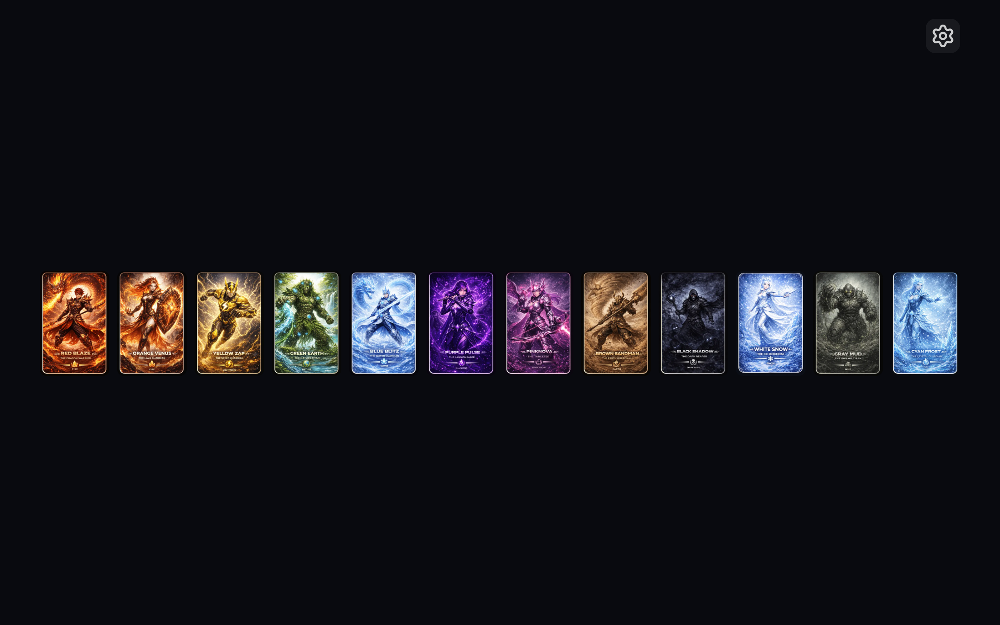
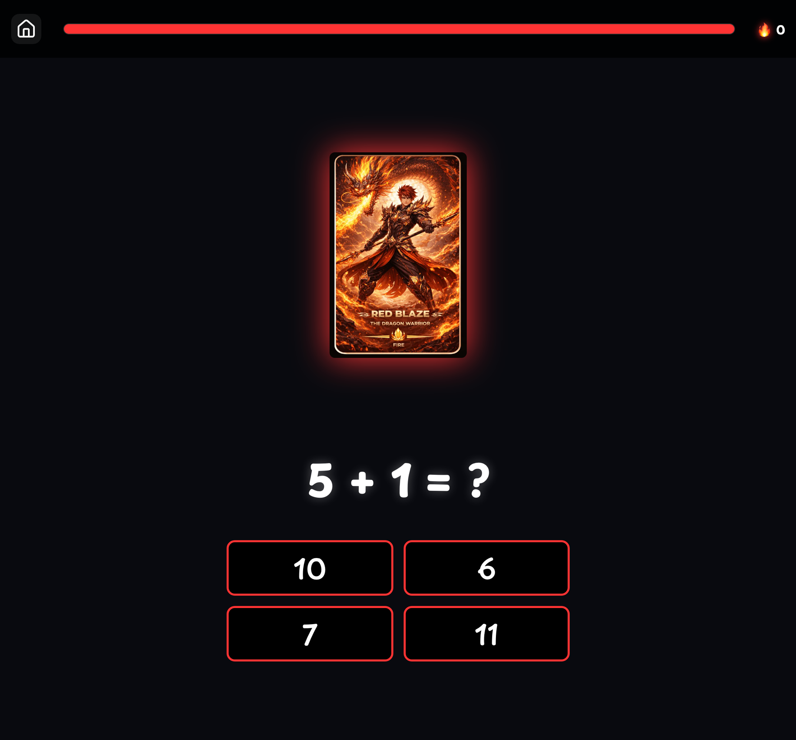
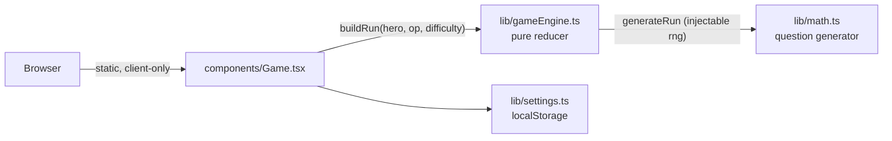

<div align="center">

# Math Hero

**Pick a hero and race the clock through math.**

Addition, subtraction, multiplication, and division across 5 difficulty tiers, wrapped in a comic-book hero theme built for kids.

[](https://github.com/bunlongheng/math-hero/actions/workflows/ci.yml)
[](https://nextjs.org)
[](https://www.typescriptlang.org)
[](LICENSE)

[**Play it live -> math-hero-bheng.vercel.app**](https://math-hero-bheng.vercel.app)



</div>

## Features

- **12 illustrated heroes** - each with its own color, element, and treasure icon; pick one to start.
- **4 operations x 5 difficulty tiers** - addition, subtraction, multiplication, division, with the number range scaling per tier.
- **Beat the clock** - a per-question countdown; run out of time and the answer is revealed.
- **Learn from every answer** - a wrong pick or a timeout reveals the correct answer before moving on.
- **Persistence** - your operation, difficulty, and sound settings plus a best score per mode are saved between sessions.



## Tech stack

| Area | Choice |
|------|--------|
| Framework | Next.js 16 (App Router) |
| Language | TypeScript (strict) |
| Styling | CSS Modules + `next/font` (self-hosted Playpen Sans) |
| Images | `next/image` (self-hosted hero art) |
| Effects | canvas-confetti, Web Audio |
| Tests | `node:test` (pure logic) + Playwright (e2e) |
| Hosting | Vercel |

## How it works



The quiz is a pure state machine: all randomness lives in the `buildRun` / `generateRun` factories (an injectable rng), so `gameReducer` is a pure, fully unit-tested function of `(state, action)`.

## Getting started

```bash
npm install
npm run dev
```

Open [http://localhost:3026](http://localhost:3026).

## Scripts

| Script | Does |
|--------|------|
| `npm run dev` | Dev server on port 3026 |
| `npm run build` | Production build |
| `npm run typecheck` | `tsc --noEmit` (app + tests) |
| `npm run lint` | ESLint |
| `npm test` | Unit tests (math + engine + settings) |
| `npm run e2e` | Playwright end-to-end tests (builds + serves on 3034) |

## License

[MIT](LICENSE) (c) 2026 Bunlong Heng

---

<p align="center">
  <sub>Built by <a href="https://bunlongheng.com">Bunlong Heng</a> &middot; <a href="https://bunlongheng.com/projects/math-hero">See it in my portfolio &rarr;</a></sub>
</p>
